Capstone project: Sparkify churn prediction
===========================================

Purpose of this project
-----------------------

This is a **supervised learning classification** project on **time-series data**. 
The purpose of this project is to demonstrate my abilities to analyse a dataset and build a model to **predict user churn** of a music streaming service called Sparkify. 

A complete step by step description is available in a Jupyter notebook, and a blog post is available on Medium for a summarized presentation of the work (https://medium.com/@mozart38). 

Note that two datasets are available: a full dataset of 12GB, that requires the deployment of a cluster to parallelize computation, and a mini-dataset of 128MB. 
In this repository the focus is on the mini-dataset for now. But note that due to the nature of this data, we wrote all the code using the **Spark Framework** to allow easy refactoring on the code to have it run with clusters on a much larger dataset.

In this repository, you will find:

- A Jupyter notebook that goes through the process of exploring the data, engineering features and building a machine leaning classification model
- The plots saved as png
- This readme file

---------------------------------------------

Requirements
------------

The code is written in Python 3.7 with the Spark Framework (version 2.4.4).

There are several dependencies for this project. The versions provided here are those used for testing.

- pandas 0.25.0
- pickle 4.0
- plotly 4.1.1
- os 

---------------------------------------------

Data exploration insights
-------------------

Data cleaning
-------------------
Note: the cleaning step was rather straight forward. 
- we want to predict if a user will churn, so we need to keep only the rows that are linked to a user > we **remove the rows with null values in the UserId column**
- we want to be able to observe the evolution of the behavior of a user, so the time information is mandatory > we **convert the timestamp column** to several time columns (year, month, date, day of the week, hour, week number)

Churn definition
-------------------
The data we have is imbalanced: less than 22% of the users churned! This is an important information for when it comes to choosing a metric to appreciate the performance of the machine learning model! 

We **defined churned** following two approaches:
- cancel service churn, aka the user leaves the service - defined using the action 'Cancellation Confirmation' of a given user
- downgrade service churn, aka the user goes from a paid to a free-tier service - defined by the 'Submit Downgrade'

Plotting 
-------------------
As a first step, we looked at some counts and aggregated or average values per week. We noticed that some actions seem more relevant than others when it comes to distinguishing churned users from active users. 
For example, when the number of songs or ads listened looks relevant, the gender or location (state) was not so much.

Here are some example of plots we rendered.

Impact of the gender
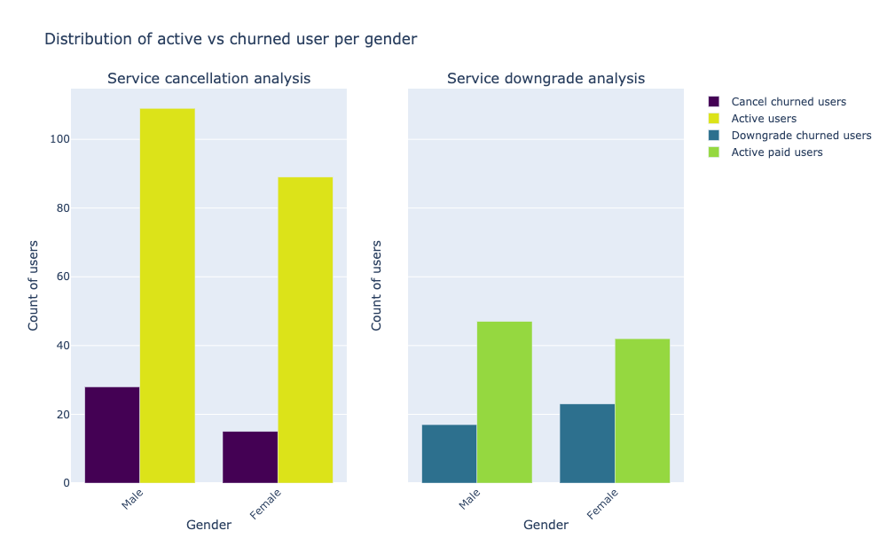

Impact of the level (paid/free) of the user
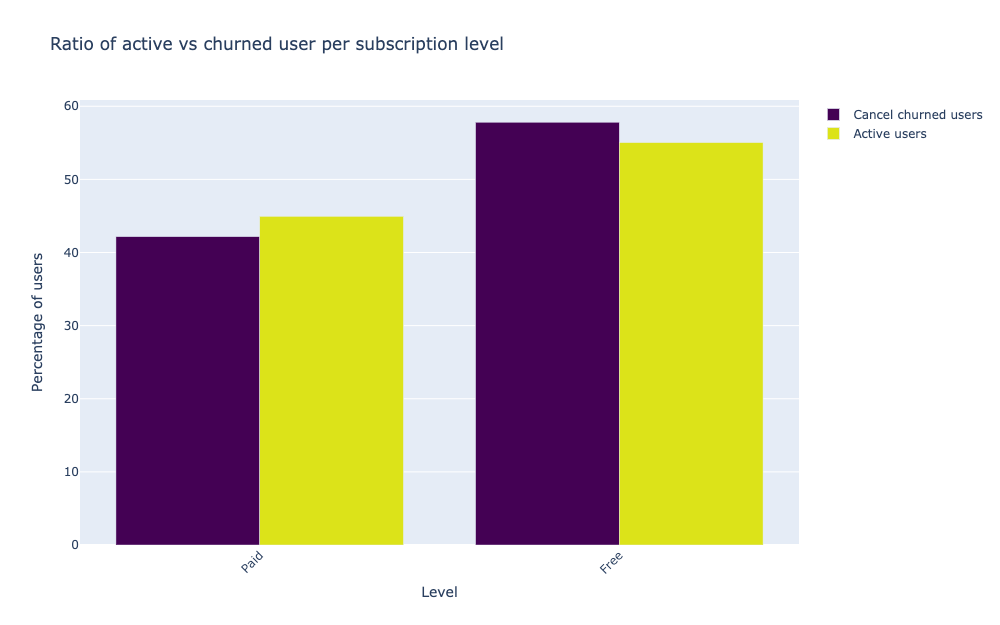

impact of the average number of songs listened to
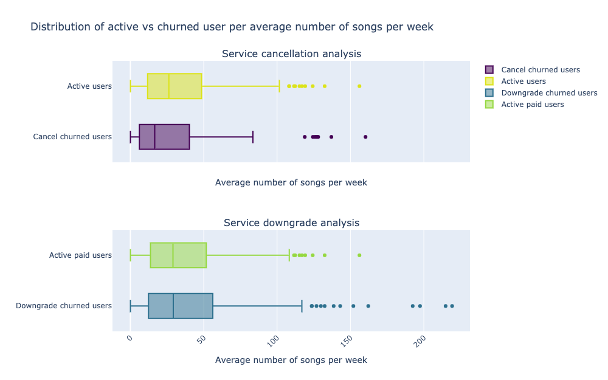

Impact of the average number of distinct artists listened to

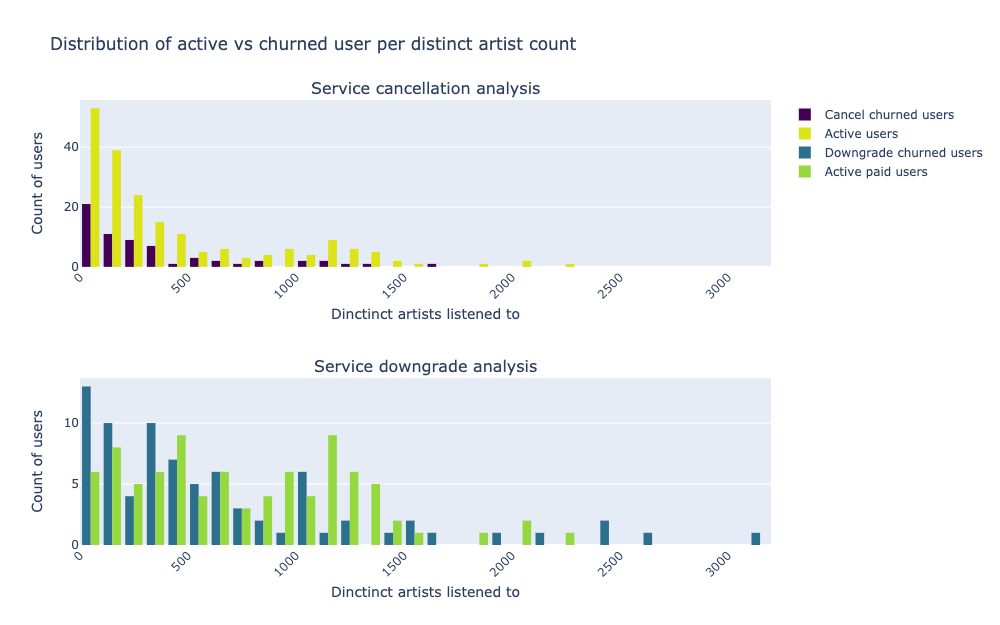

Impact of the average number of repeats listened to
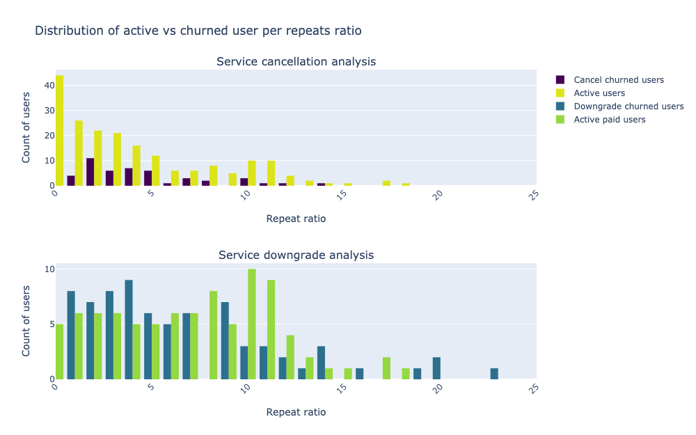

Impact of the average number of ads listened to
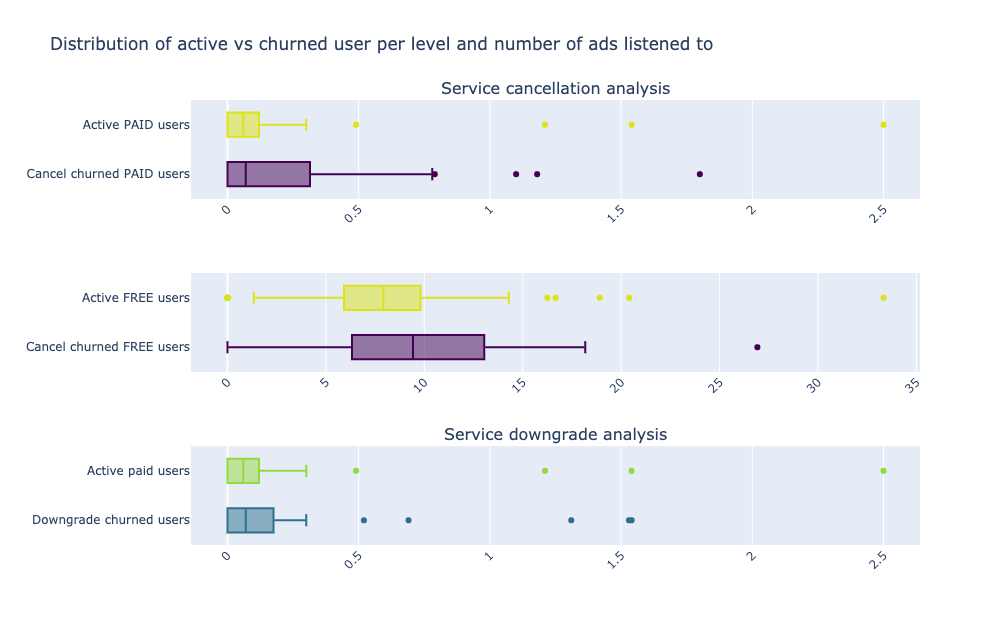

Impact of the listening time per session
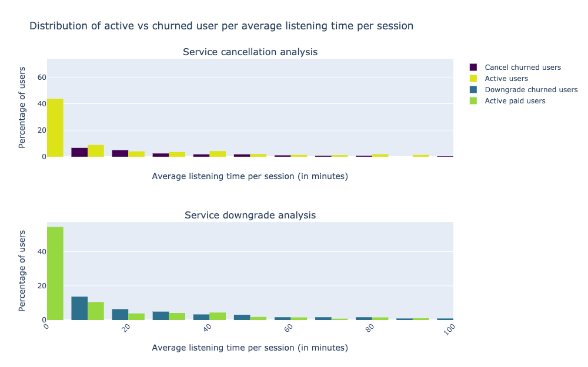

Impact of the number of logins and time between two logins
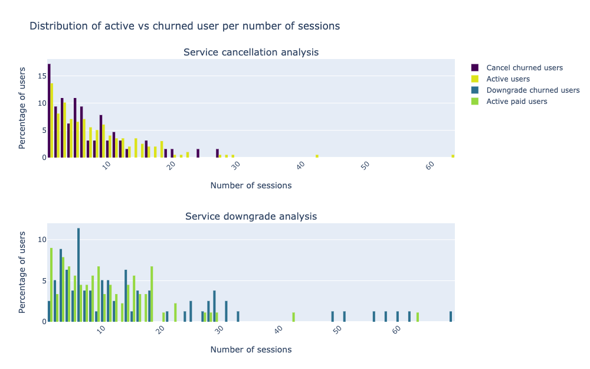
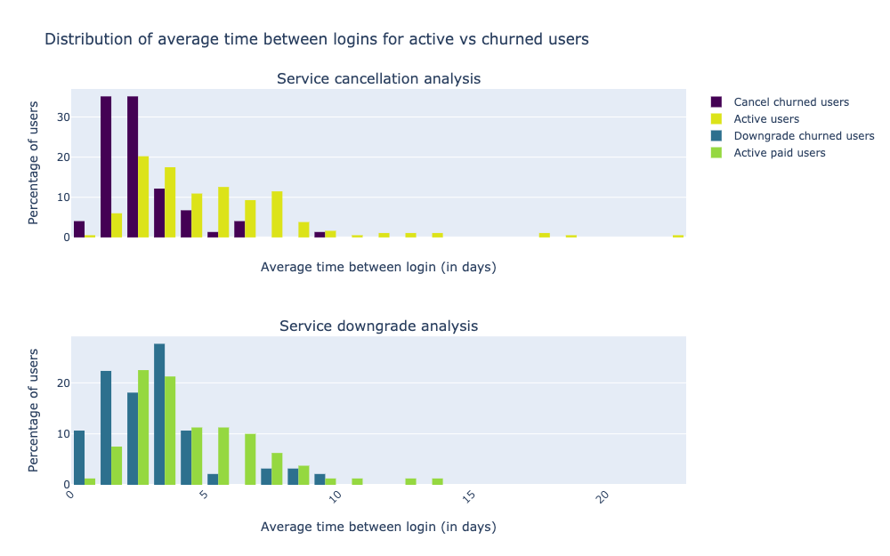

Impact of the time of the activity (count of actions):
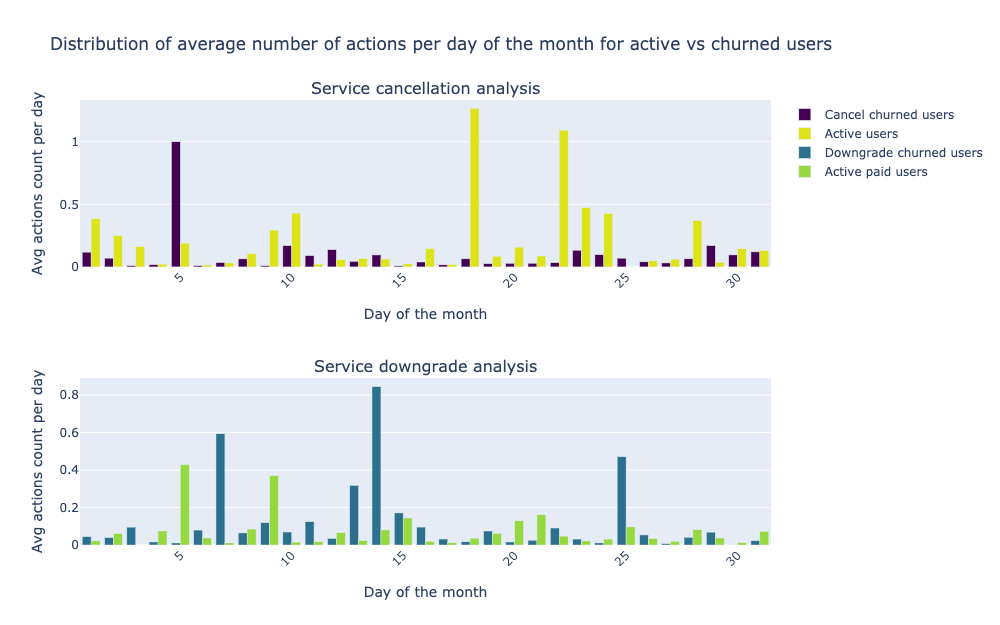
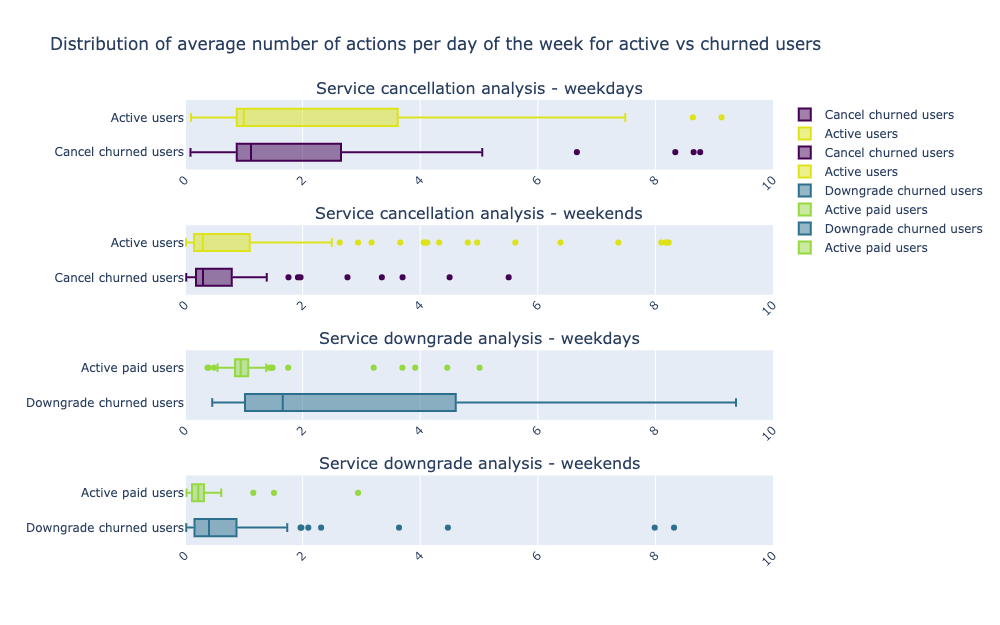

Impact of the moment the user joined (month, day of the month)
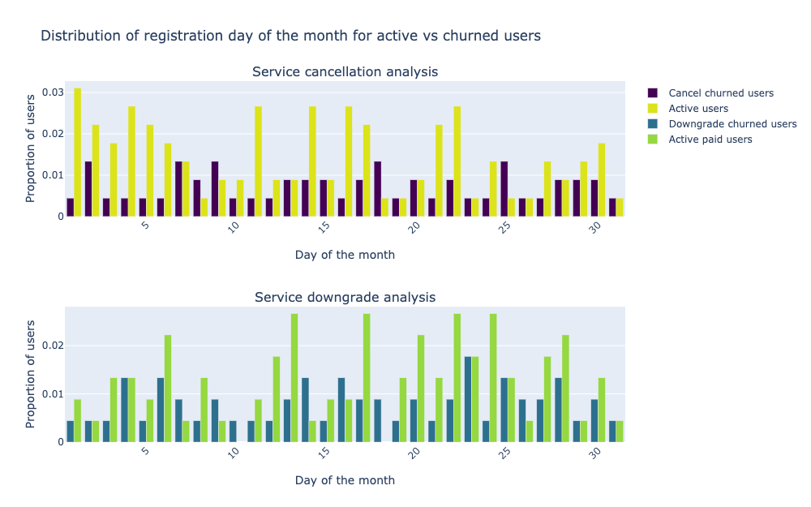
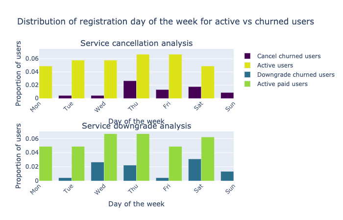

Impact of the time before an upgrade or a downgrade
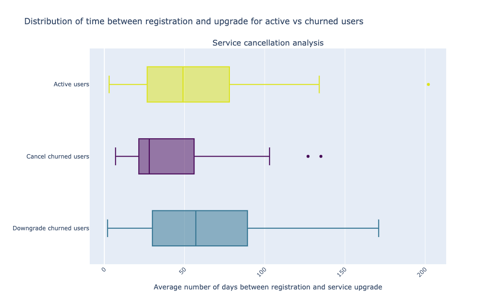
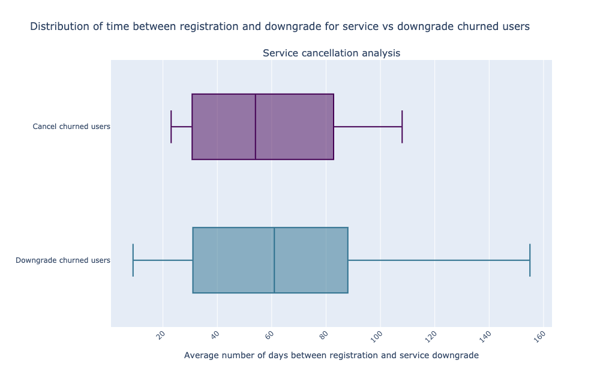
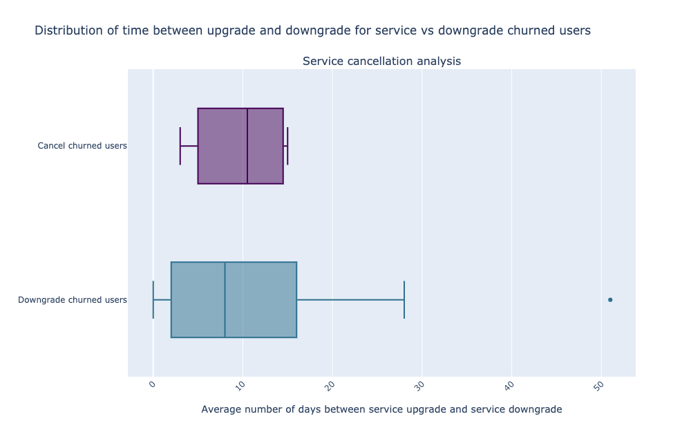

---------------------------------------------

Time-series potential
-------------------
Besides, we realised that it was actually limiting to aggregate values per user without using the full potential of time-series data. Dealing with time-series data allows us to get an idea of **how the behavior of a user changes over time**, and we do not base our prediction solely on an aggreated observation such as average, or the last event that occured.
In this extent, we decided to engineer features including both counts and deviations between one week and the preceeding ones, assign a weight to recent event and older events as to give more importance to recent events. We tested with a few ratios (80%/20%, 70%/30%, 60%/40%), and it is during the modeling step that we figured out the best results were obtained using the 70%/30% ratio. 

Feature engineering
-------------------

The feature engineering stage consisted in building a dataframe per scenario (cancel or downgrade) containing labels (churn/no churn) and a vector of the features.
The features were basically of two three types:
- categorical (gender, state, free/paid) - these were encoded using OneHotEncoding
- numerical counts (number of songs, distinct artists, logins,...)
- numerical deviation (comparison of the counts of the current week with all the previous weeks)

To build this dataframe, it is simple!
1. We compute the counts for the first week of the dataset, and we consider the deviations are equal to the counts (no history to compare to). We append one row per user for the first week to a summary dataframe that we save. 
2. We load the saved summary of the first week, and we compute the counts for the second week. We append one row per user for this second week with the counts of the second week and a comparison with the first week (difference between the counts of the two weeks), using the ratio. Basically, the value of the deviation of the first week is multiplied by 30% for example, and the value of the deviation of the second week is multiplied by 70%. We save the updated summary. 
3. We iterate through each week of our dataset and update the summary (loading and saving at each iteration). 

In the end, we have a dataframe with multiple columns, and with one row per user per week. Note that a user appears in the summary only if he/she interacted. We also keep track of the time between two interactions, so if a user didn't appear one week, the value of the time since the last interraction will simply increase and be used as a feature!

From there, we scale the numerical features - using MinMaxScaler, and we encode the categorical features. This step is extremely important as the scale of the numerical feature varies a lot (between counts and deviations, there can be a factor 1000!), and the Spark models work with numerical values. 
Then we combine all the transformed features to a single vector, and here we go!

---------------------------------------------

Modeling
-----------------------------

We are dealing with a classification problem. For this, we are going to compare three different models : Logistic Regression, Random Forest and Gradient Boosted Tree.

The purpose of this stage of this analysis is to:
- define with deviation ratio makes more sense
- select the best performing model after hyperparameter tuning

This phase was then focused on testing several combinations of models, deviation ratios and hyperparameters for each model. In order to evaluate the performance of our model, we decided to look at the F1-score, as this metric is less sensitive to the imbalance of class we are facing (a bit more than 20% of the users in the dataset we worked with actually churned). 

Our conclusions were the following:
- for the service churn, the best combination appears to be Gradient Boosted Tree, with {'maxDepth': 3, 'maxBins': 50, 'maxIter': 250, 'stepSize': 0.1}, on the 70/30 deviation ratio, with a F1-score of 83%, up to 87%.
- for the downgrade churn, the best combination appears to be Gradient Boosted Tree, with {'maxDepth': 3, 'maxBins': 50, 'maxIter': 250, 'stepSize': 0.1}, on the 80/20 deviation ratio, with a F1-score of 81-82%.

---------------------------------------------

Further work and improvements
-----------------------------

From there on, we can already foresee further work and improvements:
- improve the way we weigh older events vs newer events (using Kalman filters for example)
- convert our code to a script that can be deployed to any spark environment
- implement a pipeline to automatically recompute the prediction with new weekly data arriving, with a weekly task to recompute the summary, retrain the model and report potential churners based on latest logs
- expand our work to predict WHEN a user would churn
- deploy this code on AWS clusters to experiment with the full dataset 

---------------------------------------------

Acknowlegments and related content
------------------------------------

The dataset used in this project was provided by Udacity.
This project is part of the UDACITY Data Scientist Nanodegree.

